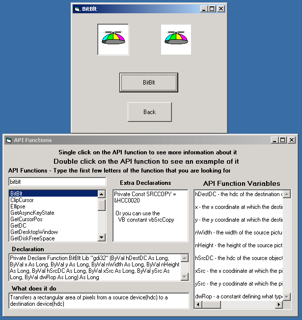



## Explanations and Examples of 25 API Calls

### Description

This program explains and demonstrates how to use 25 different API calls. Also each API call has its own example of it in use.
 
### More Info
 

             |
---                |---
**Submitted On**   |2002-06-11 13:39:12
**By**             |[Zach Hunt](https://github.com/Planet-Source-Code/PSCIndex/blob/master/ByAuthor/zach-hunt.md)
**Level**          |Intermediate
**User Rating**    |4.8 (72 globes from 15 users)
**Compatibility**  |VB 3\.0, VB 4\.0 \(16\-bit\), VB 4\.0 \(32\-bit\), VB 5\.0, VB 6\.0
**Category**       |[Windows API Call/ Explanation](https://github.com/Planet-Source-Code/PSCIndex/blob/master/ByCategory/windows-api-call-explanation__1-39.md)
**World**          |[Visual Basic](https://github.com/Planet-Source-Code/PSCIndex/blob/master/ByWorld/visual-basic.md)
**Archive File**   |[Explanatio931316112002\.zip](https://github.com/Planet-Source-Code/zach-hunt-explanations-and-examples-of-25-api-calls__1-35732/archive/master.zip)

### API Declarations

25 api calls with their explanations and examples of them in use

